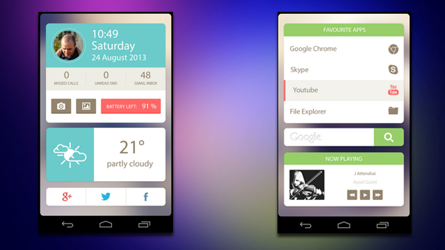

# Lesson 2

## About me

# lateinit

##

```kotlin
private lateinit var binding: ActivityMainBinding
```

## 
- Properties in Kotlin classes can be declared either as mutable using the `var`{.kotlin} keyword, or as read-only using the `val`{.kotlin} keyword.
- Properties declared as having a non-null type must be initialized in the constructor.

##

To overcome this, you can use `lateinit`{.kotlin}

- the initial value does not need to be assigned
- it is not a nullable type, so `?.`{.kotlin} and `!!`{.kotlin} are not necessary
- assign the `lateinit var`{.kotlin} a value before you use it. Otherwise, it will crash the app on a `null`{.kotlin} value. 

## Operators in reference to null

- Kotlin's type system is aimed to eliminate NullPointerException's from  code.

## Operator in regards to null

- `!!` asserts that an expression is non-null
- `?.` performs a safe call (calls a method or accesses a property if the receiver is non-null)

##

```kotlin
val a: String? = null
print(a!!.length) // >>> NPE: trying to get length of null
```

##
```kotlin
val a: String? = null
print(a?.length) // >>> null is printed in the console
```

# A data class

##

````kotlin
data class MyName (var myName: String = "", var nickName : String = "")
````

## 

A class whose main purpose is to hold data with standard functionality and utility functions is called a `data class`{.kotlin} and is marked as data.

## 

The compiler automatically derives the following members:

- `equals()`{.kotlin}/`hashCode()`{.kotlin} pair
- `toString()`{.kotlin} of the form `"MyName(myName=Arthur, nickName=Dent)"`{.kotlin}
- `componentN()`{.kotlin} functions corresponding to the properties in their order of declaration
- `copy()`{.kotlin} function 

# Apply

##

- Use `apply` for code blocks that don't return a value and mainly operate on the members of the receiver object. 
- The common case for apply is the object configuration. Such calls can be read as “apply the following assignments to the object.”

# Proper naming convention

## 
The lack of XML namespaces makes managing Android resources tedious and causes
 things to grow out of control easily, especially in large projects.
 
## 
You could define your own strategy, or apply a strategy already devices.

E.g. [the strategy of Jeroen Mols](https://jeroenmols.com/blog/2016/03/07/resourcenaming/)

## Basic principle

`what` - `where` - `description` - `size`

Description see Jeroen's [blog post](https://jeroenmols.com/blog/2016/03/07/resourcenaming/)

# Expand

##
Inside the ScrollView, add an ImageView above the TextView. When you run the app, this image, unlike the star, scrolls out of view as the text scrolls up.

## Create a custom application
whit the following layout


